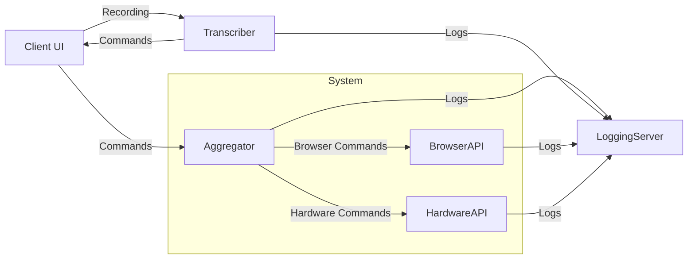

# System Architecture

```mermaid
graph LR;
    UI[Client UI] -->|Recording| Transcriber;
    Transcriber -->|Commands| UI;
    UI -->|Commands| Aggregator;
    
    subgraph System
        Aggregator -->|Browser Commands| BrowserAPI;
        Aggregator -->|Hardware Commands| HardwareAPI;
    end
    Aggregator -->|Logs| LoggingServer;
    Transcriber -->|Logs| LoggingServer;
    BrowserAPI -->|Logs| LoggingServer;
    HardwareAPI -->|Logs| LoggingServer;

```
